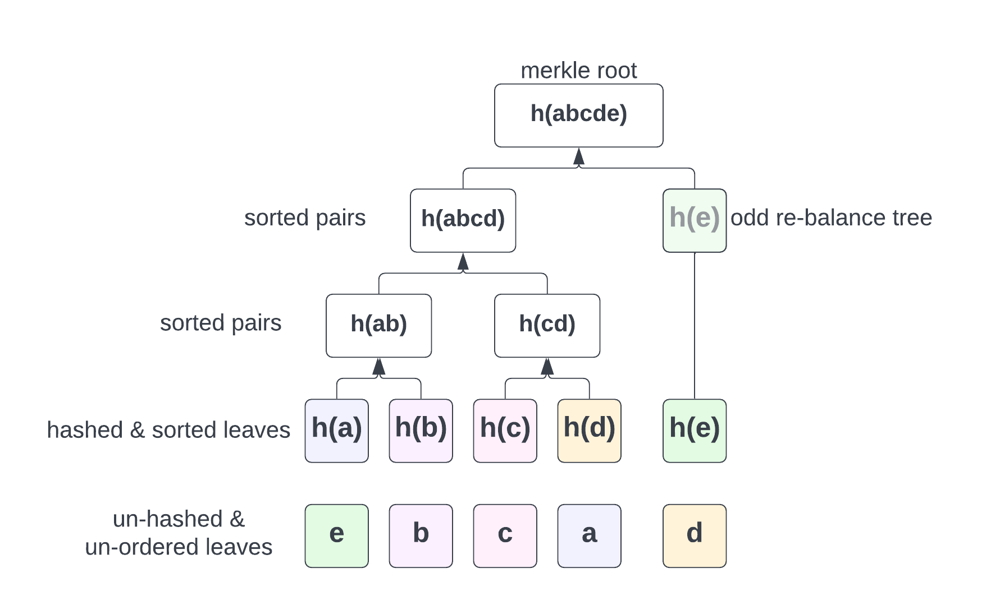

## A merkle tree implementation in Go

A merkle tree is a kind of binary tree where each node is labelled with a hash. Starting from the very bottom,
leaves will be paired and hashed together to make their parent inner-node, recursively up to the root a.k.a merkle root.

Merkle trees, are commonly used in distributed systems to efficiently compare large data set ensuring validity of such data.

Some examples that leverage merkle trees are the Git version control, AWS's QLDB, Apache's Cassandra and last but not least, blockchains.

There are different flavours of implementations, this package doesn't attempt to build an abstraction for all the
possible ones out there, it rather implements a fairly efficient specific one that can be used to experiment with the data structure and concepts.

With that said, **if you're looking to use this package to validate merkle proofs for existing blockchains you should look
elsewhere as their implementation may be different**. For example, Bitcoin's merkle, duplicates eventual odd nodes to re-balance
the tree and this implementation doesn't, thus producing a different merkle root and proof.

## Implementation details



- leaves are expected to be hashed before feeding them into the tree factory.
- leaves' order doesn't matter as they will be lexicographically sorted internally regardless.
  this is done so that we can efficiently find a leaf to build up a proof using binary search.
- inner nodes pairs will be sorted to simplify proof verification, this is so that the **Verify**
  algorithm wouldn't have to accept a proof data structure which specifies whether a node is left/right.

## Usage

Generate a new tree, build the proof for a given leaf and verify it.

```go
package main

import (
  "crypto/sha256"
  "github.com/alessandro-c/merkle"
  "hash"
  "log"
  "math/rand"
  "time"
)

func main() {
  algo := sha256.New()

  leaves := [][]byte{
    hashString(algo, "a"), hashString(algo, "b"),
    hashString(algo, "c"), hashString(algo, "d"),
    hashString(algo, "e"),
  }

  // you can change the order of leaves without affecting the end result, that is, the same merkle root
  rand.Seed(time.Now().UnixNano())
  rand.Shuffle(len(leaves), func(i, j int) {
    leaves[i], leaves[j] = leaves[j], leaves[i]
  })

  for i, l := range leaves {
    log.Printf("hex leaf #%d - %x\n", i, l)
  }

  // building up tree up to the merkle root
  tree := merkle.NewTree(algo, leaves)

  // merkle root
  log.Println("hex merkle root: ", tree.Root().Hex())

  // building proof for leaf c
  hashedLeafToProof := hashString(algo, "c")
  proof := tree.Proof(hashedLeafToProof)

  for i, h := range proof.ToHexStrings() {
    log.Printf("proof for leaf %x at index %d is : %s", hashedLeafToProof, i, h)
  }

  // verifying proof
  ok := merkle.Verify(algo, hashString(algo, "c"), tree.Root().Bytes(), proof.ToByteArrays())
  log.Println("proof is valid ?", ok)
}

func hashString(algo hash.Hash, s string) []byte {
  algo.Reset()
  algo.Write([]byte(s))
  return algo.Sum(nil)
}
```

you can write the whole tree (or sub tree) to a provided `io.Writer` for example : 

```go
// printing whole tree
tree.Root().Graphify(log.Writer())
```

With output :

```
3a64c13ffc8d22739538f49d901d909754e4ca185cf128ce7e64c8482f0cd8c6
├── a26df13b366b0fc0e7a96ec9a1658d691d7640668de633333098d7952ce0c50b
│   ├── 28b5a66c8c61ee13ad5f708a561d758b24d10abe5a0e72133c85d59821539e05
│   │   ├── 3e23e8160039594a33894f6564e1b1348bbd7a0088d42c4acb73eeaed59c009d
│   │   └── 3f79bb7b435b05321651daefd374cdc681dc06faa65e374e38337b88ca046dea
│   └── 800e03ddb2432933692401d1631850c0af91953fd9c8f3874488c0541dfcf413
│       ├── 18ac3e7343f016890c510e93f935261169d9e3f565436429830faf0934f4f8e4
│       └── 2e7d2c03a9507ae265ecf5b5356885a53393a2029d241394997265a1a25aefc6
└── ca978112ca1bbdcafac231b39a23dc4da786eff8147c4e72b9807785afee48bb
```